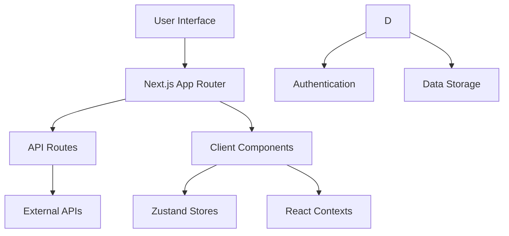

# Denbegaye Agent — Multi-Strategy AI Agent Orchestration Platform

> A production-architected platform for building, executing, and monitoring autonomous AI agents — supporting multiple reasoning strategies (ReAct, Plan-and-Execute, Reflexion, LangGraph, and custom workflow DAGs) through a visual builder backed by a distributed, queue-based execution engine.

🎥 **[Demo Video](#)** · 🔗 **[Live Demo](#)** · 📐 **[Architecture Diagram](#architecture)**

---

## For Recruiters & Technical Reviewers

This project demonstrates production-grade agentic AI infrastructure, not a wrapper around a single LLM call. Highlights:

- **Multi-strategy agent execution** — a single visual builder supports 5 selectable execution paradigms (`workflow`, `langgraph`, `react`, `plan-execute`, `reflexion`), letting users choose the right reasoning pattern per use case.
- **Distributed, queue-based execution engine** — Redis/BullMQ-backed worker service, decoupled from the API layer, supporting horizontal scaling via `SERVICE_ROLE=api|worker|all`.
- **Real-time execution observability** — live per-node execution status, structured logs, and Socket.IO-based status streaming from worker to browser.
- **Credential vault** — centralized, per-user API key/token management across multiple AI providers (OpenAI, Gemini, DeepSeek) and third-party services (Gmail, Google Sheets).
- **Data flow between agent steps** — variable resolution system that lets users bind outputs from upstream nodes into downstream node configs (a lightweight equivalent to LangGraph's state passing).
- **Graph validation before execution** — Zod-based DAG validation to catch malformed workflows before they reach the execution engine.
- **Self-audited scalability** — see the [Scalability & Roadmap](#scalability--roadmap) section below for an honest breakdown of current capacity and what's needed for enterprise scale.

**Two-service architecture:**
| Service | Role | Stack |
|---|---|---|
| `Denbegaye Agent` | Visual builder, auth, dashboard, API proxy | Next.js 16, React 18, TypeScript, Supabase, Zustand, React Flow, Socket.IO |
| `Denbegaye Agent Workers` | Distributed execution engine | Node.js, Express, Redis, BullMQ, Zod, OpenTelemetry, Socket.IO |

---

## How the Repositories Work Together

The two repositories are designed as complementary services in a single agent orchestration platform.

- `Denbegaye Agent` provides the visual workflow builder, user authentication, credential management, and API proxy endpoints.
- `Denbegaye Agent Workers` provides the execution engine that consumes queued jobs, runs DAG-based workflows, and persists audit logs.
- Execution workflow:
  1. User builds a workflow in the browser and selects an execution strategy.
  2. Frontend validates the graph locally and submits the payload to `/api/agent-run`.
  3. API proxy enqueues the job into Redis/BullMQ and returns an execution ID.
  4. Worker service claims the job, executes nodes, and emits real-time status updates.
  5. The UI receives progress events and displays final execution results.

This split allows independent scaling: the UI and auth layers can run separately from the heavy agent execution workers.

## Deployment Checklist

- ✅ Confirm environment variables for both services (`SUPABASE_URL`, `SUPABASE_SERVICE_ROLE_KEY`, `REDIS_URL`, `ENCRYPTION_KEY`)
- ✅ Deploy `Denbegaye Agent` frontend with Next.js using Vercel, Netlify, or similar hosting
- ✅ Deploy `Denbegaye Agent Workers` on a separate Node.js host or container platform
- ✅ Configure Redis and BullMQ for shared queueing across worker instances
- ✅ Enable HTTPS and secure token storage for credential management
- ✅ Set up observability: logs, metrics, and real-time Socket.IO monitoring
- ✅ Validate execution flow end to end with sample workflows before broad usage

## Testing Checklist

- ✅ Run unit tests for both repos with `npm test`
- ✅ Run end-to-end workflow execution tests through the UI and worker pipeline
- ✅ Validate real-time Socket.IO updates during execution
- ✅ Confirm retry and failure handling for worker jobs
- ✅ Verify audit logs are persisted to Supabase
- ✅ Test with multiple concurrent workflow executions

## Architecture



The application follows a modular architecture with clear separation of concerns:

- **Frontend**: React components with TypeScript for type safety
- **Backend**: Serverless API routes handling business logic
- **Database**: Supabase PostgresSQL
- **State Management**: Zustand for local state, React Context for global state

## 🚀 Features

- **AI Agent Builder**: Create intelligent multi-step workflows with a drag-and-drop interface
- **Multi-strategy execution**: Supports workflow, LangGraph, ReAct, Plan-Execute, and Reflexion modes
- **Distributed execution engine**: Worker service processes jobs asynchronously through Redis/BullMQ
- **Real-time monitoring**: Socket.IO streams node-level execution updates back to the UI
- **Credential vault**: Central storage for user API keys and service tokens
- **Graph validation**: Zod-based validation to catch broken workflows before execution

## 🔗 API Documentation

The application provides RESTful API endpoints for all major features. All endpoints require authentication via Supabase Auth.

### Authentication

All API requests must include an `Authorization: Bearer <token>` header with a valid token.

### Key Endpoints

#### Agent Management

- `POST /api/agent-run` - Execute an agent workflow
- `GET /api/agent-workflows` - List user workflows
- `POST /api/agent-workflows` - Create new workflow

### Response Format

All endpoints return JSON responses with consistent structure:

```json
{
  "success": true,
  "data": { ... },
  "error": null
}
```

Error responses:

```json
{
  "success": false,
  "data": null,
  "error": "Error message"
}
```

## 📋 Prerequisites

- Node.js 18+
- npm

## 🚀 Getting Started

1. **Clone the repository**

   ```bash
   git clone https://github.com/your-username/denbegnaye.git
   cd denbegnaye
   ```

2. **Install dependencies**

   ```bash
   npm install
   ```

3. **Set up environment variables**

   Create a `.env.local` file in the root directory:

   ```env
   # Supabase Configuration
   NEXT_PUBLIC_SUPABASE_URL=https://your-project.supabase.co
   NEXT_PUBLIC_SUPABASE_ANON_KEY=your_anon_key

   ```

4. **Run the development server**

   ```bash
   npm dev
   ```

   Open [http://localhost:3000](http://localhost:3000) in your browser.

## 📁 Project Structure

```
denbegnaye/
├── app/                          # Next.js app router pages and layouts
│   ├── api/                      # Serverless API routes
│   │   ├── agent-run/            # Agent execution endpoints
│   │   └── ...                   # Other feature APIs
│   ├── agent-builder/            # Agent workflow builder page
│   ├── dashboard/                # Analytics dashboard
│   ├── login/                    # Authentication pages
│   ├── layout.tsx                # Root layout with providers
│   └── page.tsx                  # Home page
├── components/                   # React components organized by feature
│   ├── agent-nodes/              # Visual nodes for agent builder
│   ├── auth/                     # Authentication components
│   ├── ui/                       # Reusable UI primitives (Radix UI)
│   ├── error-boundary.tsx        # Global error handling
│   ├── loading-state.tsx         # Loading indicators
│   └── theme-provider.tsx        # Theme management
├── lib/                          # Core business logic and utilities
│   ├── agentEngine.ts            # Agent execution engine
│   ├── executionEngine.ts        # Workflow execution logic
│   ├── utils.ts                  # Helper functions
│   └── encryption.ts             # Data encryption utilities
├── stores/                       # Zustand state management
│   └── agentBuilderStore.ts      # Agent builder state
├── types/                        # TypeScript type definitions
│   └──
├── constants/                    # Application constants and config
├── contexts/                     # React context providers
│   └── AuthContext.tsx           # Authentication context
├── hooks/                        # Custom React hooks
├── public/                       # Static assets and icons
├── styles/                       # Global styles
├── __tests__/                    # Test files and setup
└── config/                       # Configuration files
```

### Code Organization Principles

- **Feature-based structure**: Components and APIs are grouped by business domain
- **Separation of concerns**: UI, business logic, and data access are clearly separated
- **Reusability**: Common components are in `ui/`, utilities in `lib/`
- **Type safety**: Comprehensive TypeScript types for all data structures
- **Error handling**: Centralized error boundaries and consistent error patterns
  │ ├──
  │ ├── utils.ts # Helper functions
  │ └── encryption.ts # Encryption utilities
  ├── services/ # Business logic services
  ├── stores/ # Zustand state stores
  ├── types/ # TypeScript type definitions
  ├── constants/ # Application constants
  ├── contexts/ # React contexts
  ├── hooks/ # Custom React hooks
  └── public/ # Static assets

````

## 🧪 Development

### Code Quality Standards

- **TypeScript**: Strict type checking enabled
- **ESLint**: Next.js recommended rules with Prettier integration
- **Prettier**: Consistent code formatting
- **JSDoc**: Comprehensive documentation for all public APIs

### Development Scripts

```bash
# Development server
npm run dev

# Type checking
npm run type-check

# Linting
npm run lint
npm run lint:fix

# Code formatting
npm run format
npm run format:check

# Testing
npm run test
npm run test:watch
npm run test:coverage

# Build analysis
npm run analyze
````

### Testing Strategy

Tests are organized in `__tests__/` with setup in `setup.ts`. We use:

- **Jest** for unit and integration tests
- **React Testing Library** for component testing
- **@testing-library/jest-dom** for DOM assertions

Example test structure:

```
__tests__/
├── components/
│   └── Button.test.tsx
├── lib/
│   └── utils.test.ts
└── api/
    └── campaigns.test.ts
```

### Code Style Guidelines

- **Naming**: camelCase for variables/functions, PascalCase for components/types
- **File naming**: kebab-case for components (e.g., `user-profile.tsx`)
- **Imports**: Group by external libraries, then internal modules
- **Error handling**: Use try-catch with specific error types
- **Comments**: JSDoc for functions, inline comments for complex logic

## 🚀 Deployment

### Vercel (Recommended)

1. Connect your GitHub repository to Vercel
2. Add environment variables in Vercel dashboard
3. Deploy automatically on push

### Manual Build

```bash
# Build for production
npm build

# Start production server
npm start
```

## 🔒 Security

- All API keys are stored as environment variables
- Supabase security rules protect database access
- Input validation with Zod schemas
- HTTPS enforced in production
- Security headers configured

## 🤝 Contributing

We welcome contributions! Please follow these guidelines:

### Development Workflow

1. **Fork and Clone**

   ```bash
   git clone https://github.com/your-username/denbegnaye.git
   cd denbegnaye
   ```

2. **Set up development environment**

   ```bash
   npm install
   cp .env.example .env.local  # Configure environment variables
   npm run dev
   ```

3. **Create feature branch**

   ```bash
   git checkout -b feature/your-feature-name
   ```

4. **Development standards**
   - Write tests for new features
   - Ensure all tests pass: `npm run test`
   - Check code quality: `npm run lint && npm run type-check`
   - Format code: `npm run format`

5. **Commit guidelines**
   - Use conventional commits: `feat:`, `fix:`, `docs:`, `refactor:`
   - Keep commits focused and descriptive

6. **Submit PR**
   - Ensure PR description explains the change and includes screenshots if UI-related
   - Link related issues
   - Request review from maintainers

### Code Review Process

- All PRs require at least one approval
- CI checks must pass (lint, test, type-check)
- Maintainers may request changes for style or functionality
- Squash merge for clean history

### Adding New Features

1. **Plan the feature**: Create an issue with detailed requirements
2. **API design**: Define API endpoints and data structures first
3. **Component structure**: Plan component hierarchy and state management
4. **Testing**: Write tests before implementation
5. **Documentation**: Update README and add JSDoc comments

### Reporting Issues

- Use GitHub Issues with detailed descriptions
- Include steps to reproduce, expected vs actual behavior
- Add screenshots for UI issues
- Specify browser/OS for frontend issues

## 📝 License

This project is licensed under Denbegnaye PLC - see the [LICENSE](LICENSE) file for details.

## 📞 Support

For support, email support@denbegnaye.com or join our Discord community.

## 🙏 Acknowledgments

- Built with [Next.js](https://nextjs.org/)
- UI components from [Radix UI](https://www.radix-ui.com/)
- Icons from [Lucide React](https://lucide.dev/)
- Styling with [Tailwind CSS](https://tailwindcss.com/)
